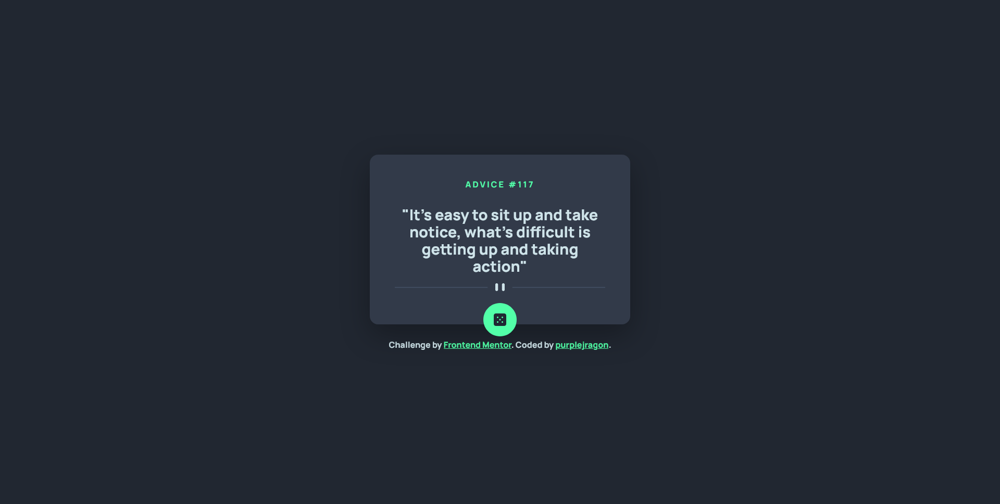

# Frontend Mentor - Advice generator app solution

This is a solution to the [Advice generator app challenge on Frontend Mentor](https://www.frontendmentor.io/challenges/advice-generator-app-QdUG-13db). Frontend Mentor challenges help you improve your coding skills by building realistic projects.

## Table of contents

- [Overview](#overview)
  - [The challenge](#the-challenge)
  - [Screenshot](#screenshot)
  - [Links](#links)
- [My process](#my-process)
  - [Built with](#built-with)
  - [What I learned](#what-i-learned)
  - [Continued development](#continued-development)

## Overview

### The challenge

Users should be able to:

- Click the button to generate advice.

### Screenshot

### Links

- Solution URL: [Add solution URL here](https://your-solution-url.com)
- Live Site URL: [Add live site URL here](https://your-live-site-url.com)

## My process

### Built with

- HTML5
- CSS3
- Flexbox
- Vue

### What I learned

I learned how to use Vue to make button that actually do things.

### Continued development

I want to get better at making responsive sizes and layouts. I also want to get better at positions items.

### Useful resources

- [The Vue.js Guide](https://vuejs.org/guide/quick-start.html) - This helped me get started with Vue.

## Author

- Github - [purplejragon](https://www.github.com/purplejragon)
